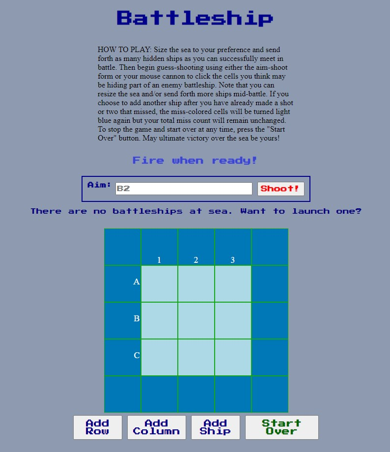

# Battleship

My final project in Harvard's ultra-famous CS50x. 
My first public repo on github.
For which I wrote my first readme...you are here!

## Introduction

This is a simple web app for playing my version of Battleship Solitaire. It was designed to be *self-explanitory* and *intuitive* to play. 

## Languages 

- HTML 
- CSS 
- JS

## Setup

To run this web app, place all its files in a dedicated folder on your PC and then double-click `battleship.final.html` to open in the browser.

## Scope of Functionality

As soon as the page loads, a "HOW TO PLAY" paragraph appears under the primary title. This paragraph is removed upon any user initiation of game-play. 

The battle-zone is enlargeable up to 9 x 9 cells. As many ships may be hidden in the battle-zone as desired up to the number that will fit. Each time the "Add Ship" button is pressed, a ship is hidden at random (both orientation - either horizontal or vertical - and overall position is randomly assigned) in any available set of three juxtaposed cells. Battle-zone size and ship-count adjustments may be made at any point without otherwise interrupting game-play except in that if a ship is added mid-game, all miss-colored cells will be refreshed. 

"Shot"/guess-values may be input into the aim-shoot form. Clicking the "Shoot!" button and pressing Enter are equally effective to apply them. Also, shots/guesses may be clicked into the battle-zone directly with the mouse. 

Note that the aim-shoot form is case-insensitive and also insensitive to spaces before or after the shot/guess characters. An input corresponding to a cell outside the battle-zone will be rejected and the player notified by alert. An input with first two characters such as "ab", "1b", "78", "@m", etc. will be rejected as invalid and the player notified by alert. 

When a guess is made, the cell guessed turns either dirty-pink - a miss - or red with battleship2.jpg image overlaid - a hit. 

When any ship on the battle-zone is hit the third time, an alert appears to celebrate the kill and present which ship was sunk (numbered based on order in which ships were added). When the alert is dismissed, the cells containing that ship are given a dark blue background to denote that the ship has already been sunk, and game play continues.

When the final ship is sunk, an alert appears to celebrate game completion and present both shot success rate and total number of misses. When this alert is dismissed, all cells except those containing sunken ships turn green and in 1.5 sec the game is automatically restarted.

Whenever non-zero, 
1. hit count, 
2. miss count, 
3. number of ships left to sink,  
4. number of ships already sunk,

are displayed in the respective corners of the gameboard. 

## A Word About the Source

Of course the hardest part of coding this web app was the Javascript. And that is why I wanted to build it. Javascript seemed the most important language for me personally that CS50 touched on, yet the course gave precious little instruction on the topic. So in preparation for this final project I purchased and read *Head First JavaScript Programming* (2014). 

This book contains a walk-through of a similar project. To maximize my learning from the experience, instead of just reading and copying Head First's project, I took the idea and created it as best I knew how *before* going over Head First's code for the project. Then, after reading Head First's code involving a lot more functions and objects, I took my own code, improved it (still without copying anything from Head First's code) and extended the web app's functionality to be much more dynamic and self-explanatory than Head First's.

## Needed Improvement

One minor bug (see lines 171 - 177 of .js file): the aim-shoot form *always* accepts the first two non-space characters such as "a2" as a valid input whether or not these characters are followed by other alphabetic or numeric characters. For example, inputs such as "  A11" or "b2kevenf  " would be accepted and equivalent to inputs "A1" and "B2" respectively. Therefore, some functionality is lost if the battle-zone is enlarged beyond 9 x 9. I coded 9 x 9 to be the maximum size, but this is obviously not a complete fix. 

## To Hide and/or Unhide All Ships

In the .css file, simply add or remove background-color property from the ".ship" rule.
